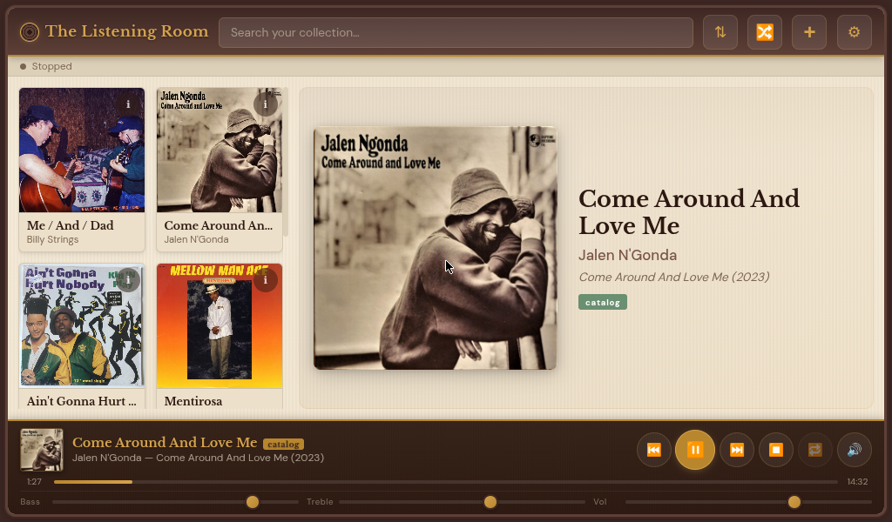
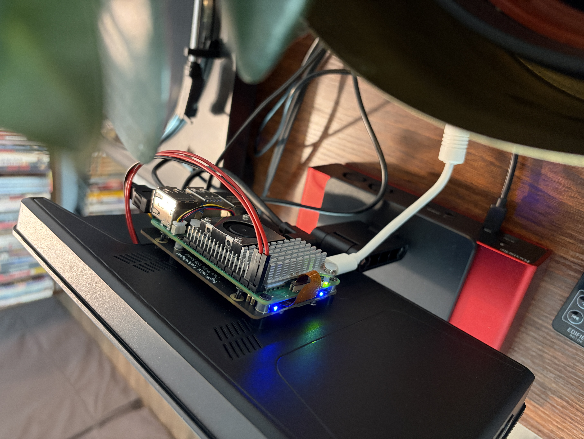
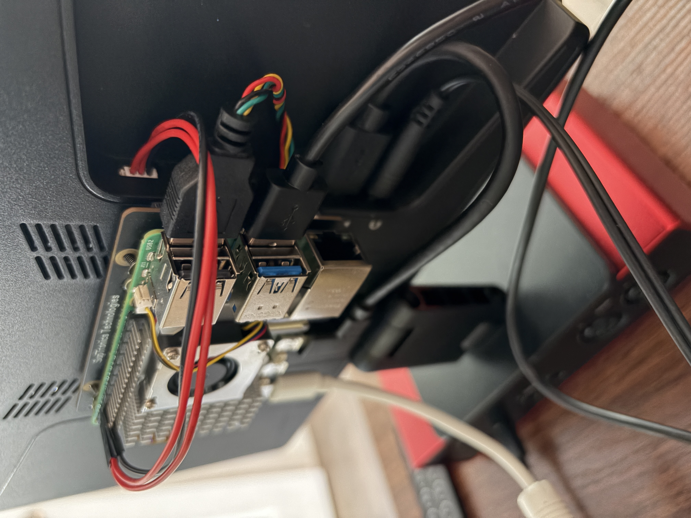
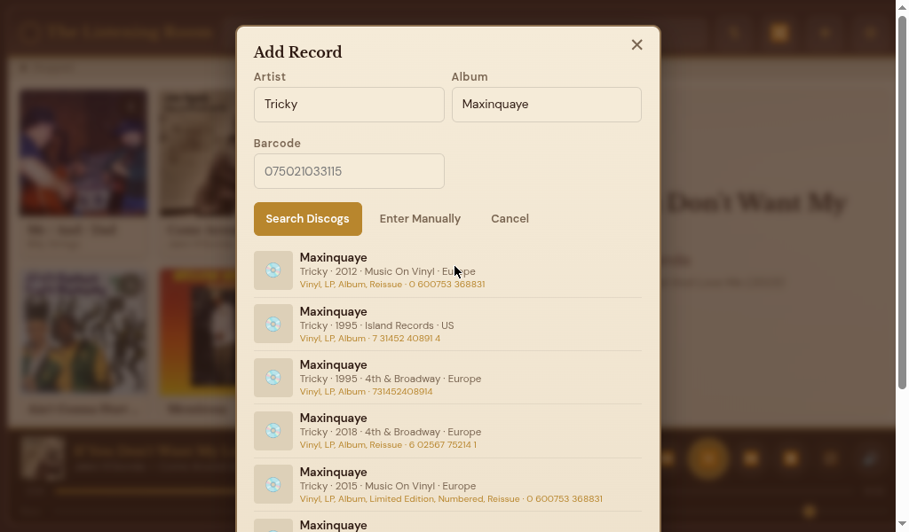
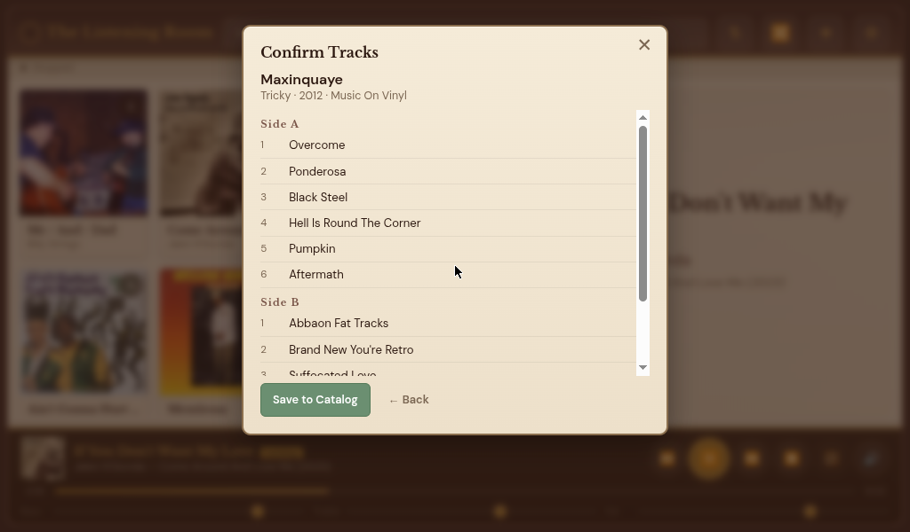
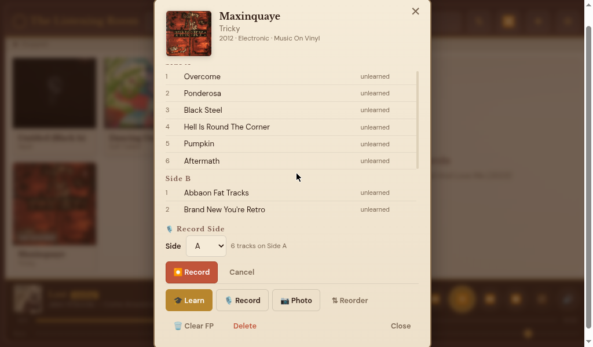
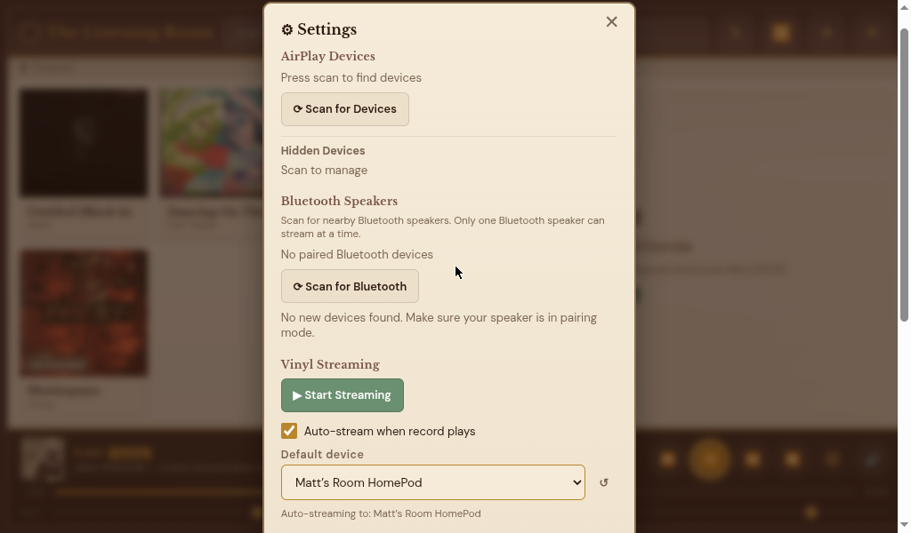

# Vinyl Streamer

**A Raspberry Pi-powered vinyl jukebox that records, recognizes, and streams your records -so you can enjoy them without the wear.**

<p align="center">
  
</p>

Vinyl Streamer captures audio from your turntable through a USB audio interface, learns your record collection through audio fingerprinting, and streams lossless audio to AirPlay and Bluetooth speakers throughout your home. It also records full album sides as FLAC files, turning your Pi into a vinyl jukebox -play back your entire collection at CD quality without ever touching the physical records.

Drop the needle once to teach it. After that, play the vinyl or play the recording -your choice.

> **A personal note:** I'm not an audiophile, and I don't pretend to be. This started as a personal project -I just wanted a simple way to play my records on speakers around the house without re-buying everything digitally. I also wanted to preserve my vinyl. Some of my records are irreplaceable, and every play wears the grooves a little more. Now I can record each album once, and from then on play the lossless FLAC recording whenever I want -saving the physical vinyl for when I really want that ritual. I know vinyl purists may have opinions about digitizing analog audio, and that's totally fair. I built this for myself and I'm sharing it in case it's useful to anyone else.

---

## What It Does

Vinyl Streamer sits between your turntable and your speakers. It captures analog audio via a USB DAC, identifies the record using local audio fingerprinting, and streams 16-bit/44.1kHz lossless audio to any AirPlay or Bluetooth speaker on your network.

But it goes further than just streaming live vinyl. Every album you teach it gets recorded as a high-quality FLAC file. Those recordings live in your catalog and can be played back at any time -no turntable needed. Think of it as a jukebox for your vinyl collection: browse your albums on the touchscreen or your phone, tap one, and it plays through your speakers. The physical records stay safely on the shelf.

<p align="center">
  
</p>

### Key Features

- **Vinyl Jukebox** - Browse and play your entire vinyl collection from the touchscreen or any browser. Recordings are stored as lossless FLAC files, so you get the full quality of the original recording without putting wear on your records.
- **Automatic Record Recognition** - Drop the needle and the system identifies what's playing within seconds using Chromaprint audio fingerprinting against a local database. No cloud service required.
- **Lossless Streaming** - Streams CD-quality audio (16-bit/44.1kHz PCM) to AirPlay and Bluetooth speakers. Multi-room AirPlay support with independent volume control.
- **Album Recording** - Records full album sides as FLAC files with automatic track boundary detection. Silence-based splitting with Discogs track duration fallback for tricky gaps. Color-coded input level meter shows recording levels in real time.
- **Gapless Playback** - Seamless transitions between album sides with pre-buffered ffmpeg decoding. No gaps or clicks when Side A ends and Side B begins.
- **Queue and Playlist** - Add albums to a playback queue from any album card or the detail modal. Queue panel slides out from the right to show what's coming up next.
- **Track-Level Playback** - Tap any track in the album detail view to start playing from that point. Skip forward and back between tracks with transport controls.
- **Album Favorites** - Heart your favorite albums for quick access. Sort your collection by favorites to find them fast.
- **Listening Stats** - Track your listening history with play counts, top albums, most-played tracks, and total listening hours. Stats are always one tap away.
- **Discogs Integration** - Search Discogs to add albums to your catalog with track listings, artwork, and metadata. No API token required for casual use.
- **Live EQ** - Real-time bass and treble shelf EQ applied before streaming.
- **Touch-Friendly UI** - A warm, walnut-and-cream interface designed for a dedicated touchscreen. Fully responsive on phones and tablets too.
- **Now Playing Screensaver** - After idle time, a full-screen now-playing display takes over with spinning album art, track progress, side indicator, and animated EQ visualization.
- **Track Boundary Editor** - Manually adjust where tracks start and end if the automatic silence detection got it wrong. Edit times directly in the album detail modal.
- **Library Export** - Download your catalog database and a JSON manifest of your entire library for backup. Pair with rsync for automated FLAC backup scripts.
- **Vinyl Preservation** - Record once, play forever. Keep your rare and favorite records safe while still enjoying them daily.

---

## Hardware

| Component | What I Use | Notes |
|---|---|---|
| **Raspberry Pi** | [CanaKit Pi 5 Starter Kit (8GB)](https://www.amazon.com/dp/B0CRSNCJ6Y) | Developed and tested on a Pi 5 8GB. Other models may work but are untested. |
| **USB Audio Interface** | Focusrite Scarlett 2i2 (4th Gen) | Any class-compliant USB DAC with line-level input works. |
| **NVMe SSD** | [Geekworm X1005 PCIe HAT](https://www.amazon.com/dp/B0DTH2Y1WN) + [Silicon Power 256GB NVMe](https://www.amazon.com/dp/B08QBJ2YMG) | Stores FLAC recordings and the fingerprint database. Much faster and more reliable than SD card storage. |
| **Touchscreen** | [ROADOM 10.1" IPS Touch Display (1024x600)](https://www.amazon.com/dp/B0CSQGZ91P) | Runs the web UI in Chromium kiosk mode as a dedicated now-playing display and jukebox interface. |
| **Turntable** | Any with line-level output | If your turntable has a built-in preamp, connect directly. Otherwise, run it through a phono preamp first. |
| **Speakers** | Any AirPlay or Bluetooth speaker | See compatibility notes below. |

The Pi mounts right on the back of the touchscreen with the NVMe HAT, keeping the whole setup compact:

<p align="center">
  
  
</p>

### Speaker Compatibility

**AirPlay:** Vinyl Streamer uses AirPlay (RAOP), not AirPlay 2. Individual HomePods (ungrouped), AirPort Express units, and most third-party AirPlay receivers work well. Apple TVs are not supported, and HomePods in stereo pairs or multi-room groups won't work since grouped HomePods require AirPlay 2.

**Bluetooth:** Supports A2DP Bluetooth speakers and headphones. One Bluetooth device can stream at a time, alongside any number of AirPlay devices.

### Wiring

```
Turntable ──▶ (Phono Preamp if needed) ──▶ USB Audio Interface (line in) ──▶ Raspberry Pi (USB)
                                                                                    │
                                                                              NVMe SSD (storage)
                                                                                    │
                                                                              WiFi / Ethernet
                                                                                    │
                                                                      AirPlay & Bluetooth Speakers
```

---

## Getting Started

### Prerequisites

- Raspberry Pi OS (Bookworm or later) or Debian 13+ (64-bit)
- Python 3.10+
- ffmpeg, fpcalc (Chromaprint CLI), PortAudio, bluez-alsa-utils

### Install

```bash
# Clone the repository
git clone https://github.com/palavido-dev/vinyl-airplay.git
cd vinyl-airplay

# Install system dependencies
sudo apt update
sudo apt install -y python3-pip ffmpeg libchromaprint-tools portaudio19-dev libasound2-dev bluez-alsa-utils

# Create a virtual environment and install Python dependencies
python3 -m venv venv
source venv/bin/activate
pip install numpy sounddevice pyatv fastapi uvicorn pillow requests jinja2 python-multipart

# Run it
python3 main.py
```

The web UI will be available at `http://<your-pi-ip>:8080`.

### Running as a Service

```bash
sudo tee /etc/systemd/system/vinyl-airplay.service > /dev/null <<EOF
[Unit]
Description=Vinyl AirPlay Streamer
After=network-online.target sound.target
Wants=network-online.target

[Service]
Type=simple
User=$USER
WorkingDirectory=$(pwd)
ExecStart=$(pwd)/venv/bin/python main.py
Restart=on-failure
RestartSec=5

[Install]
WantedBy=multi-user.target
EOF

sudo systemctl daemon-reload
sudo systemctl enable vinyl-airplay
sudo systemctl start vinyl-airplay
```

---

## How to Use

1. **Connect your hardware** -Plug your turntable (via preamp if needed) into your USB audio interface, and plug the interface into the Pi.

2. **Open the web UI** -Navigate to `http://<your-pi-ip>:8080` from any device on your network, or use the touchscreen directly.

3. **Add an album** -Search for your record on Discogs to import the track listing and artwork. No API token needed for basic use.

<p align="center">
  
  
</p>

4. **Record and teach** -Start a recording session, then play Side A all the way through. The system records a lossless FLAC and automatically detects track boundaries to build a fingerprint database. Flip and repeat for Side B.

<p align="center">
  
</p>

5. **Enjoy two ways:**
   - **Live vinyl** -Drop the needle anytime. Vinyl Streamer recognizes the record and streams to your speakers automatically.
   - **Jukebox mode** -Tap any album in your catalog to play the FLAC recording through your speakers. No turntable needed -your vinyl stays on the shelf.

<p align="center">
  
</p>

---

## Settings & Device Management

Configure AirPlay devices, Bluetooth speakers, auto-streaming, audio input, and storage all from the settings panel.

<p align="center">
  
</p>

---

## How It Works

### Audio Fingerprinting

Vinyl Streamer uses [Chromaprint](https://acoustid.org/chromaprint) to generate audio fingerprints -compact acoustic signatures of your music. During the "learning" phase, it captures overlapping fingerprint windows as each track plays and stores them in a local SQLite database. On future plays, it samples the incoming audio and matches against the local database. All matching happens on-device -no internet required after initial catalog setup.

### Recording & Track Splitting

When recording an album side, the system captures the full side as a continuous FLAC file while simultaneously detecting track boundaries using silence-based gap detection, with Discogs track duration data as a fallback for records with short or unclear gaps. Each track is fingerprinted independently for recognition.

### Streaming

Audio is captured at 16-bit/44.1kHz from the USB interface, processed through a real-time EQ stage, and streamed to AirPlay devices via [pyatv](https://github.com/postlund/pyatv) and to Bluetooth speakers via BlueALSA. Multiple AirPlay speakers can receive simultaneously, plus one Bluetooth device.

---

## Project Structure

```
vinyl-airplay/
├── main.py          # FastAPI server, streaming, audio pipeline, API
├── catalog.py       # Album catalog, fingerprinting, Discogs integration
├── recorder.py      # Recording, silence detection, track splitting
├── player.py        # FLAC playback engine with track navigation
├── templates/
│   └── index.html   # Web UI (single-page app)
├── settings.json    # User configuration (auto-created)
└── data/            # SQLite database, artwork, FLAC recordings
```

---

## Roadmap

- [x] **Bluetooth speaker support** - Stream to Bluetooth A2DP speakers and headphones
- [x] **Unified device management** - Single UI for AirPlay, Bluetooth, and local output devices
- [x] **Gapless playback** - Seamless side transitions with pre-buffered decoding
- [x] **Queue and playlist** - Add albums to a playback queue with a slide-out panel
- [x] **Track-level playback** - Tap any track to start playing from that point
- [x] **Album favorites** - Heart albums and sort by favorites
- [x] **Listening statistics** - Play counts, top albums, listening hours
- [x] **Mobile-responsive UI** - Full phone and tablet support
- [x] **Recording level meter** - Color-coded dB readout during recording
- [x] **Turntable animation** - Spinning vinyl disc in now-playing, red glow when recording
- [x] **Enhanced screensaver** - Progress bar, side indicator, spinning art
- [x] **Track boundary editor** - Manual adjustment of track start/end times
- [x] **Library export** - Database and manifest download for backup
- [ ] **WiFi setup portal** - Captive portal for headless first-time WiFi configuration
- [ ] **One-line install script** - Automated installer for existing Pi setups
- [ ] **Flashable Pi image** - Pre-built SD card image for zero-config setup

---

## Support This Project

If you find this useful and want to support continued development, donations are appreciated.

- **[Donate via PayPal](https://paypal.me/palavido)**
- **[Sponsor on GitHub](https://github.com/sponsors/palavido-dev)** *(pending approval)*

---

## License

MIT License -see [LICENSE](LICENSE) for details.

---

*Built for the love of vinyl -and the desire to keep it spinning for years to come.*
