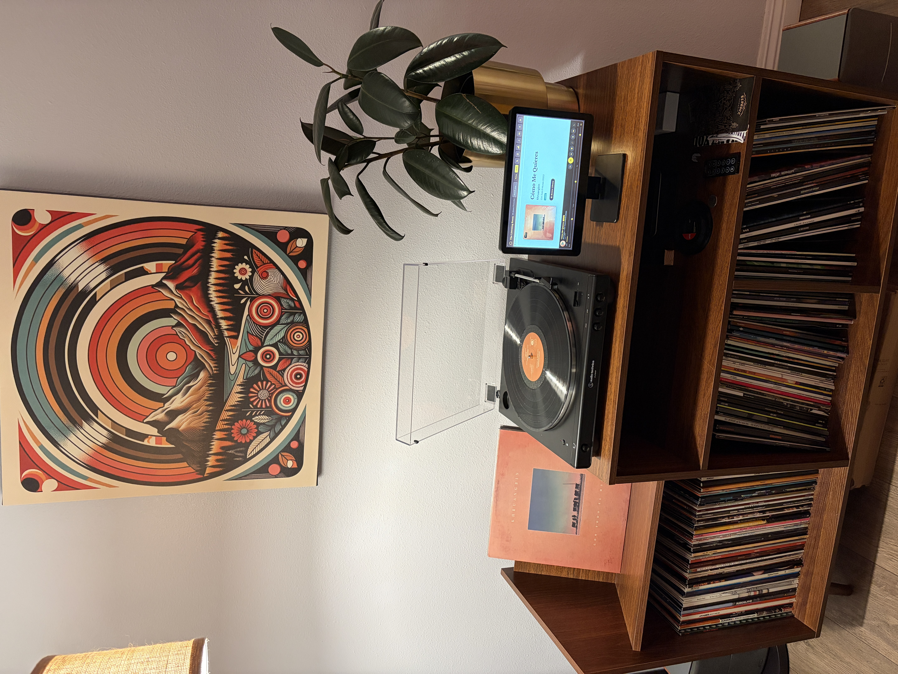
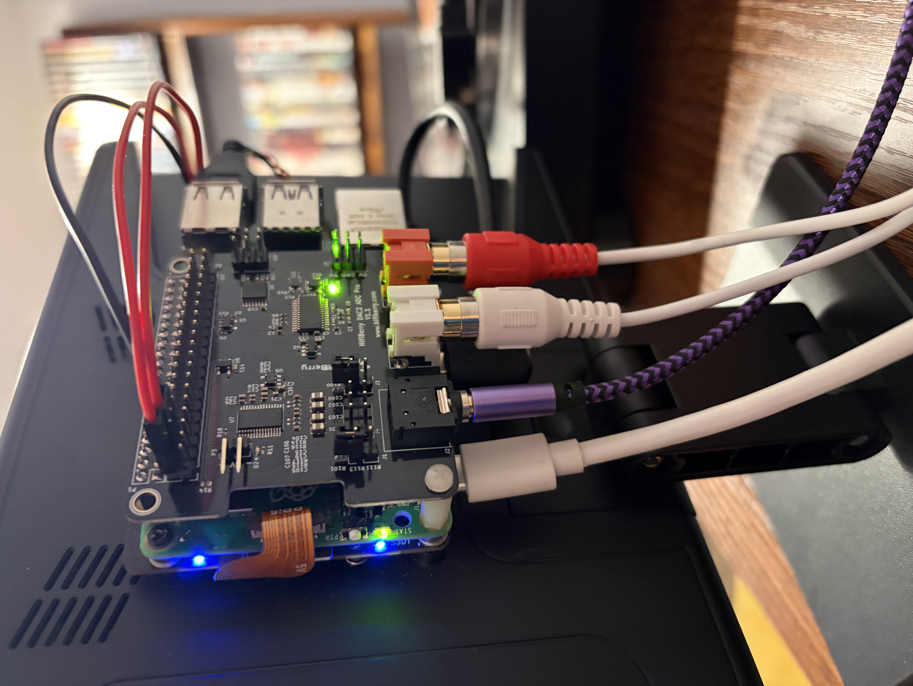

# Vinyl Streamer

**A Raspberry Pi-powered vinyl jukebox that records, recognizes, and streams your records -so you can enjoy them without the wear.**

<p align="center">
  
</p>

Vinyl Streamer captures audio from your turntable through a line-level audio interface, learns your record collection through audio fingerprinting, and streams lossless audio to AirPlay and Bluetooth speakers throughout your home. It also records full album sides as FLAC files, turning your Pi into a vinyl jukebox -play back your entire collection at CD quality without ever touching the physical records.

Drop the needle once to teach it. After that, play the vinyl or play the recording -your choice.

> **Looking for the manual?** Full documentation lives in the [docs folder](docs/):
>
> - **[Getting Started](docs/getting-started.md)** - 5 minute orientation tour.
> - **[User Guide](docs/user-guide.md)** - feature by feature walkthrough of the web UI with common workflows.
> - **[Reference](docs/reference.md)** - exhaustive button level and API level reference.

> **A personal note:** I'm not an audiophile, and I don't pretend to be. This started as a personal project -I just wanted a simple way to play my records on speakers around the house without re-buying everything digitally. I also wanted to preserve my vinyl. Some of my records are irreplaceable, and every play wears the grooves a little more. Now I can record each album once, and from then on play the lossless FLAC recording whenever I want -saving the physical vinyl for when I really want that ritual. I know vinyl purists may have opinions about digitizing analog audio, and that's totally fair. I built this for myself and I'm sharing it in case it's useful to anyone else.

---

## What It Does

Vinyl Streamer sits between your turntable and your speakers. It captures analog audio via a line-level ADC, identifies the record using local audio fingerprinting, and streams 16-bit/44.1kHz lossless audio to any AirPlay or Bluetooth speaker on your network.

But it goes further than just streaming live vinyl. Every album you teach it gets recorded as a high-quality FLAC file. Those recordings live in your catalog and can be played back at any time -no turntable needed. Think of it as a jukebox for your vinyl collection: browse your albums on the touchscreen or your phone, tap one, and it plays through your speakers. The physical records stay safely on the shelf.

<p align="center">
  
</p>

### Key Features

- **Vinyl Jukebox** - Browse and play your entire vinyl collection from the touchscreen or any browser. Recordings are stored as lossless FLAC files, so you get the full quality of the original recording without putting wear on your records.
- **Automatic Record Recognition** - Drop the needle and the system identifies what's playing within seconds using Chromaprint audio fingerprinting against a local database. No cloud service required.
- **CD-Quality Streaming** - Streams 16-bit/44.1kHz PCM audio to AirPlay, Bluetooth, and local speakers. Multi-room AirPlay support with independent volume control. See [Audio Quality](#audio-quality-and-lossless) for details on each output path.
- **Album Recording** - Records full album sides as FLAC files with automatic track boundary detection. Silence-based splitting with Discogs track duration fallback for tricky gaps. Color-coded input level meter shows recording levels in real time.
- **Gapless Playback and Crossfade** - Seamless transitions between album sides with pre-buffered ffmpeg decoding. Optional equal-power crossfade (up to 2 seconds) blends smoothly between sides instead of a hard cut. Configure from settings or leave at zero for pure gapless.
- **Queue and Playlists** - Add albums to a playback queue from any album card or the detail modal. Queue panel slides out from the right to show what's coming up next. Drag to reorder sides, remove individual items, and save the current queue as a named playlist to reload later.
- **Track-Level Playback** - Tap any track in the album detail view to start playing from that point. Skip forward and back between tracks with transport controls. Remaining time shown in the progress bar.
- **Album Favorites and Star Ratings** - Heart your favorite albums and rate them 1-5 stars. Sort your collection by favorites or rating to find the best of your collection fast.
- **Library Shuffle** - Shuffle your entire recorded collection with one tap. All albums are shuffled and queued for continuous playback.
- **Listening Stats** - Track your listening history with play counts, top albums, most-played tracks, and total listening hours. Stats are always one tap away.
- **Discogs Integration** - Search Discogs to add albums to your catalog with track listings, artwork, and metadata. No API token required for casual use.
- **Live EQ** - Real-time bass and treble shelf EQ applied before streaming.
- **Touch-Friendly UI** - A warm, walnut-and-cream interface designed for a dedicated touchscreen. Fully responsive on phones and tablets too. Keyboard shortcuts for kiosk mode (space for play/pause, arrows for skip, Q for queue, Escape to close panels).
- **Full-Text Search** - Search your collection by artist, title, genre, label, year, or personal notes. Results filter instantly as you type.
- **Now Playing Screensaver** - After idle time, a full-screen now-playing display fades in with spinning album art, track progress, side indicator, and animated EQ visualization. Fades out smoothly when you interact with the screen.
- **Album Notes** - Add personal notes to any album in your collection - pressing details, condition, where you picked it up. Click to edit right from the album detail modal.
- **Track Boundary Editor** - Manually adjust where tracks start and end if the automatic silence detection got it wrong. Edit times directly in the album detail modal.
- **Library Export** - Download your catalog database and a JSON manifest of your entire library for backup. Pair with rsync for automated FLAC backup scripts.
- **Vinyl Preservation** - Record once, play forever. Keep your rare and favorite records safe while still enjoying them daily.

---

## Hardware

| Component | What I Use | Notes |
|---|---|---|
| **Raspberry Pi** | [CanaKit Pi 5 Starter Kit (8GB)](https://www.amazon.com/dp/B0CRSNCJ6Y) | Developed and tested on a Pi 5 8GB. Other models may work but are untested. |
| **Audio Interface HAT** | [HiFiBerry DAC2 ADC Pro](https://www.hifiberry.com/shop/boards/hifiberry-dac2-adc-pro/) | Pi HAT with a stereo line-level ADC (PCM186x) and DAC (PCM512x). Originally built with a Focusrite Scarlett 2i2 (4th Gen) USB interface; transitioned to the HiFiBerry for an all-in-one Pi-mounted design with no USB cables. Any class-compliant USB DAC with line-level input also works. |
| **NVMe SSD** | [SupTronics Dual NVMe SSD Shield](https://www.amazon.com/s?k=suptronics+dual+nvme+ssd+shield) + [Silicon Power 256GB NVMe](https://www.amazon.com/dp/B08QBJ2YMG) | Stores FLAC recordings and the fingerprint database. Much faster and more reliable than SD card storage. Earlier builds used a Geekworm X1005 PCIe HAT; either works. |
| **Touchscreen** | [ROADOM 10.1" IPS Touch Display (1024x600)](https://www.amazon.com/dp/B0CSQGZ91P) | Runs the web UI in Chromium kiosk mode as a dedicated now-playing display and jukebox interface. |
| **Turntable** | Any with line-level output | If your turntable has a built-in preamp, connect directly. Otherwise, run it through a phono preamp first. |
| **Speakers** | Any AirPlay or Bluetooth speaker | See compatibility notes below. |

The Pi mounts right on the back of the touchscreen with the NVMe HAT, keeping the whole setup compact:

<p align="center">
  
</p>

### Speaker Compatibility

**AirPlay:** Vinyl Streamer uses AirPlay (RAOP), not AirPlay 2. Individual HomePods (ungrouped), AirPort Express units, and most third-party AirPlay receivers work well. Apple TVs are not supported, and HomePods in stereo pairs or multi-room groups won't work since grouped HomePods require AirPlay 2.

**Bluetooth:** Supports A2DP Bluetooth speakers and headphones. One Bluetooth device can stream at a time, alongside any number of AirPlay devices.

### Wiring

```
Turntable ──▶ (Phono Preamp if needed) ──▶ HiFiBerry DAC2 ADC Pro (line in) ──▶ Raspberry Pi (GPIO HAT)
                                                                                    │
                                                                              NVMe SSD (storage)
                                                                                    │
                                                                              WiFi / Ethernet
                                                                                    │
                                                                      AirPlay & Bluetooth Speakers
```

---

## Getting Started

### Prerequisites

- Raspberry Pi OS (Bookworm or later) or Debian 13+ (64-bit)
- Python 3.10+
- ffmpeg, fpcalc (Chromaprint CLI), PortAudio, bluez-alsa-utils

### Install

The easiest way is to use the one-line installer:

```bash
curl -sSL https://raw.githubusercontent.com/palavido-dev/vinyl-airplay/main/install.sh | sudo bash
```

This automatically handles all dependencies, creates the systemd services, and gets the app running.

Alternatively, for manual setup:

```bash
# Clone the repository
git clone https://github.com/palavido-dev/vinyl-airplay.git
cd vinyl-airplay

# Install system dependencies
sudo apt update
sudo apt install -y python3-pip ffmpeg libchromaprint-tools portaudio19-dev libasound2-dev bluez-alsa-utils

# Create a virtual environment and install Python dependencies
python3 -m venv venv
source venv/bin/activate
pip install -r requirements.txt

# Run it
python3 main.py
```

The web UI will be available at `http://<your-pi-ip>:8080`.

### Running as a Service

If you used the installer, services are set up automatically. For manual setup:

```bash
sudo tee /etc/systemd/system/vinyl-airplay.service > /dev/null <<EOF
[Unit]
Description=Vinyl AirPlay Streamer
After=network-online.target sound.target
Wants=network-online.target

[Service]
Type=simple
User=$USER
WorkingDirectory=$(pwd)
ExecStart=$(pwd)/venv/bin/python main.py
Restart=on-failure
RestartSec=5

[Install]
WantedBy=multi-user.target
EOF

sudo systemctl daemon-reload
sudo systemctl enable vinyl-airplay
sudo systemctl start vinyl-airplay
```

### Updating

Vinyl Streamer can check for and install updates directly from the app. The update system automatically:

- Checks the latest version from the remote repository
- Downloads and installs updated code and dependencies
- Restarts the application with zero data loss
- Can rollback automatically if something goes wrong

To check for updates, open the app settings and look for the "Check for Updates" section. If an update is available, tap "Update Now". The app will restart automatically when finished.

The update system shows your current version, how many commits behind you are, and displays progress during the update process.

### Troubleshooting

Seeing WiFi disconnects, especially under load or on a mesh network? The Pi's built-in Broadcom WiFi tends to roam between mesh access points and drop. See [WiFi keeps dropping](docs/reference.md#wifi-keeps-dropping-especially-on-mesh-networks) in the Reference for the diagnosis and the one-time fix.

---

## Mobile Access and HTTPS

The web UI is available over plain HTTP on port 8080 for the local touchscreen and desktop browsers. For mobile features that require camera access (like the barcode scanner), browsers require HTTPS. Vinyl Streamer runs an HTTPS server on port 8443 for this purpose.

The install script automatically sets up [mkcert](https://github.com/FiloSottile/mkcert) to generate a local Certificate Authority and trusted certificates. To use HTTPS on your phone, you just need to install the CA certificate once:

1. Open the app on your phone at `http://<your-pi-ip>:8080`
2. Go to Settings and find the "Mobile Access" section
3. Tap "Download Certificate"
4. **iPhone/iPad:** Install the profile in Settings > General > VPN and Device Management, then enable trust in Settings > General > About > Certificate Trust Settings
5. **Android:** Install via Settings > Security > Encryption and Credentials > Install a certificate > CA certificate

After installing the CA, access the app at `https://<your-pi-ip>:8443` and camera-dependent features like the barcode scanner will work.

If your Pi's IP address changes, you can regenerate the certificates from the Mobile Access section in Settings.

---

## How to Use

1. **Connect your hardware** -Plug your turntable (via preamp if needed) into the line-input of your audio interface. If you're using the HiFiBerry DAC2 ADC Pro, it mounts directly onto the Pi's GPIO header. If you're using a USB interface like the Scarlett, connect it to one of the Pi's USB ports.

2. **Open the web UI** -Navigate to `http://<your-pi-ip>:8080` from any device on your network, or use the touchscreen directly.

3. **Add an album** -Search for your record on Discogs to import the track listing and artwork. No API token needed for basic use.

<p align="center">
  
</p>

4. **Record and teach** -Start a recording session, then play Side A all the way through. The system records a lossless FLAC and automatically detects track boundaries to build a fingerprint database. Flip and repeat for Side B.

<p align="center">
  
</p>

5. **Enjoy two ways:**
   - **Live vinyl** -Drop the needle anytime. Vinyl Streamer recognizes the record and streams to your speakers automatically.
   - **Jukebox mode** -Tap any album in your catalog to play the FLAC recording through your speakers. No turntable needed -your vinyl stays on the shelf.

<p align="center">
  
</p>

For a complete walkthrough of the web UI, including Shelves, multi select, queue, playlists, stats, and every settings group, see the **[User Guide](docs/user-guide.md)**.

---

## Settings & Device Management

Configure AirPlay devices, Bluetooth speakers, auto-streaming, audio input, recording detection sensitivity, and storage all from the settings panel.

<p align="center">
  
</p>

See the **[Settings section of the User Guide](docs/user-guide.md#settings)** for a complete description of every setting, or the **[Settings section of the Reference](docs/reference.md#settings-modal)** for field by field detail.

---

## How It Works

### Audio Fingerprinting

Vinyl Streamer uses [Chromaprint](https://acoustid.org/chromaprint) to generate audio fingerprints -compact acoustic signatures of your music. During the "learning" phase, it captures overlapping fingerprint windows as each track plays and stores them in a local SQLite database. On future plays, it samples the incoming audio and matches against the local database. All matching happens on-device -no internet required after initial catalog setup.

### Recording & Track Splitting

When recording an album side, the system captures the full side as a continuous FLAC file while simultaneously detecting track boundaries using silence-based gap detection, with Discogs track duration data as a fallback for records with short or unclear gaps. Each track is fingerprinted independently for recognition.

Recording and auto-streaming begin once the input rises above a configurable detection threshold. If you run a quieter turntable or preamp and playback is not picked up automatically, lower the **Recording Detection** threshold in Settings.

### Streaming

Audio is captured at 16-bit/44.1kHz from the audio interface, processed through a real-time EQ stage (bass and treble shelving filters), and streamed to AirPlay devices via [pyatv](https://github.com/postlund/pyatv), to Bluetooth speakers via BlueALSA, or to the browser via Web Audio API. Multiple AirPlay speakers can receive simultaneously, plus one Bluetooth device. For a deeper look at what happens to the audio during playback and how each output path compares, see [Audio Quality](#audio-quality-and-lossless).

### Audio Quality and "Lossless"

Throughout this project, "lossless" refers to how the audio is captured and stored. Recordings are saved as FLAC files, a lossless codec that preserves the full quality of the analog-to-digital conversion from your audio interface. Nothing is lost at the storage level.

During playback, the audio goes through a processing chain before it reaches your speakers: FLAC is decoded to 16-bit PCM, converted to floating point for the EQ stage (shelving filters running at 64-bit float precision), then converted back to 16-bit integer for output. That round-trip and the EQ processing itself introduce changes that are technically not reversible. The difference is imperceptible to human ears, but the output is not bit-for-bit identical to what's in the FLAC file.

If you've ever listened to a record through a receiver and adjusted the bass or treble knobs, that's the same idea. The moment the signal passes through any EQ stage, analog or digital, it's no longer a perfect reproduction of the source. Nobody in the vinyl world considers that a flaw. It's just how listening works. The digital EQ here is doing exactly what your amplifier's tone controls do in a traditional setup.

What reaches your speakers depends on the output path:

- **Local speakers (ALSA):** Processed 16-bit PCM is sent directly to the DAC with no additional encoding. This is the most direct path and the closest to the source after EQ processing.
- **AirPlay (RAOP):** The same processed PCM is wrapped in a WAV container and transmitted via Apple's RAOP protocol. No additional compression is applied during transport, so quality is equivalent to local output.
- **Bluetooth (A2DP/SBC):** On top of the playback processing, Bluetooth adds SBC encoding, which is lossy. Most consumer Bluetooth speakers negotiate SBC by default. This is a noticeable step down from local or AirPlay, but perfectly fine for casual listening.
- **Browser ("This Device"):** Processed PCM is streamed over HTTP and decoded in real time by the Web Audio API. Quality is equivalent to local output, limited only by your device's audio hardware.

In short: FLAC storage is lossless. Playback processing colors the audio slightly (just like your amp's tone knobs do), and the final quality depends on the output path. Local, AirPlay, and browser output preserve the processed audio faithfully. Bluetooth adds a lossy encoding step.

---

## Project Structure

The app began as a single `main.py` and has since been split into focused modules: a thin FastAPI entry point that wires together per-domain API routers and the audio, playback, and recording engines.

```
vinyl-airplay/
├── main.py                  # FastAPI app and lifespan; wires routers + engines together
├── app_state.py             # Shared runtime state, background-task spawner, WebSocket broadcast
├── config.py                # Settings load/save, paths, template environment
│
├── catalog.py               # Album catalog, fingerprinting, Discogs integration
├── recorder.py              # Recording buffer, silence detection, track splitting
├── player.py                # FLAC playback engine with track navigation
├── exporter.py              # Catalog database and JSON manifest export
│
├── streaming.py             # Live vinyl stream coordinator and listen mode
├── audio_streams.py         # Capture callback and audio sink classes
├── audio_eq.py              # Real-time EQ (bass/treble shelving filters)
├── audio_mp3.py             # MP3 encoder for the browser / HTTP stream
├── transports_bluetooth.py  # Bluetooth (BlueALSA / A2DP) output
│
├── recording_engine.py      # Album-side auto-finalize, encode/save, stall watchdog
├── player_engine.py         # Playback and queue orchestration
├── learn_engine.py          # Fingerprint "learn" sessions
├── recognition.py           # Live recognition callbacks and artwork helpers
├── device_helpers.py        # Local / Bluetooth device discovery, capture channels
│
├── routes_*.py              # API routers by domain (catalog, eq, bluetooth, system, settings, export, stats)
│
├── make_collage.py          # Library cover collage builder
├── wifi_setup.py            # Captive portal WiFi setup
├── install.sh               # One line installer
├── kiosk.sh                 # Chromium kiosk launcher
├── templates/
│   └── index.html           # Web UI (single page app)
├── docs/                    # Documentation
│   ├── getting-started.md
│   ├── user-guide.md
│   ├── reference.md
│   └── images/              # UI screenshots
├── screenshots/             # Hardware photos
├── settings.json            # User configuration (auto created)
└── data/                    # SQLite database, artwork, FLAC recordings
```

For a deeper look at each module and every HTTP API route, see the **[Reference](docs/reference.md)**.

---

## Roadmap

- [x] **Bluetooth speaker support** - Stream to Bluetooth A2DP speakers and headphones
- [x] **Unified device management** - Single UI for AirPlay, Bluetooth, and local output devices
- [x] **Gapless playback** - Seamless side transitions with pre-buffered decoding
- [x] **Queue and playlist** - Add albums to a playback queue with a slide-out panel
- [x] **Track-level playback** - Tap any track to start playing from that point
- [x] **Album favorites** - Heart albums and sort by favorites
- [x] **Listening statistics** - Play counts, top albums, listening hours
- [x] **Mobile-responsive UI** - Full phone and tablet support
- [x] **Recording level meter** - Color-coded dB readout during recording
- [x] **Turntable animation** - Spinning vinyl disc in now-playing, red glow when recording
- [x] **Enhanced screensaver** - Progress bar, side indicator, spinning art
- [x] **Track boundary editor** - Manual adjustment of track start/end times
- [x] **Library export** - Database and manifest download for backup
- [x] **Queue management** - Drag-to-reorder and remove individual sides from the queue
- [x] **Album notes** - Personal notes field for pressing info, condition, provenance
- [x] **Remaining time display** - Now-playing bar and screensaver show time remaining
- [x] **Screensaver transitions** - Smooth fade in/out instead of hard cut
- [x] **Unrecorded album highlighting** - Visual distinction for albums not yet recorded
- [x] **Crossfade** - Equal-power crossfade between album sides, configurable 0-2 seconds
- [x] **Persistent playlists** - Save and load named playlists from the queue panel
- [x] **Full-text search** - Search by artist, title, genre, label, year, and notes
- [x] **Star ratings** - 1-5 star ratings with sort-by-rating option
- [x] **Library shuffle** - Shuffle all recorded albums into a single queue
- [x] **Keyboard shortcuts** - Space, arrows, Q, S, Escape for kiosk and desktop
- [x] **Side count indicator** - "Side 2 of 4" display in now-playing bar
- [x] **WiFi setup portal** - Captive portal for headless first-time WiFi configuration
- [x] **One-line install script** - Automated installer for existing Pi setups
- [x] **Auto-update mechanism** - Check for and install updates directly from the app with automatic rollback on failure
- [ ] **Flashable Pi image** - Pre-built SD card image for zero-config setup

---

## Support This Project

If you find this useful and want to support continued development, donations are appreciated.

- **[Donate via PayPal](https://paypal.me/palavido)**
- **[Sponsor on GitHub](https://github.com/sponsors/palavido-dev)** *(pending approval)*

---

## License

MIT License -see [LICENSE](LICENSE) for details.

---

*Built for the love of vinyl -and the desire to keep it spinning for years to come.*
