# Reference

Exhaustive button level, field level, and API level reference for Vinyl Streamer. Use this when you want to know exactly what a specific control does or when you are integrating with the HTTP API.

> **Just getting oriented?** Start with [Getting Started](getting-started.md). **Want a guided feature tour?** See the [User Guide](user-guide.md).

---

## Contents

- [Header](#header)
- [Library grid](#library-grid)
- [Shelves home](#shelves-home)
- [Sort and group panel](#sort-and-group-panel)
- [Multi select action bar](#multi-select-action-bar)
- [Album detail modal](#album-detail-modal)
- [Add record modal](#add-record-modal)
- [Settings modal](#settings-modal)
- [Listening Statistics modal](#listening-statistics-modal)
- [Duplicates modal](#duplicates-modal)
- [Keyboard shortcuts modal](#keyboard-shortcuts-modal)
- [EQ modal](#eq-modal)
- [Learn overlay](#learn-overlay)
- [Output picker](#output-picker)
- [Queue panel](#queue-panel)
- [Playlists panel](#playlists-panel)
- [Smart playlist builder](#smart-playlist-builder)
- [Now Playing hero and bar](#now-playing-hero-and-bar)
- [Screensaver](#screensaver)
- [Keyboard shortcuts](#keyboard-shortcuts)
- [HTTP API](#http-api)
- [CLI and services](#cli-and-services)
- [File layout](#file-layout)

---

## Header

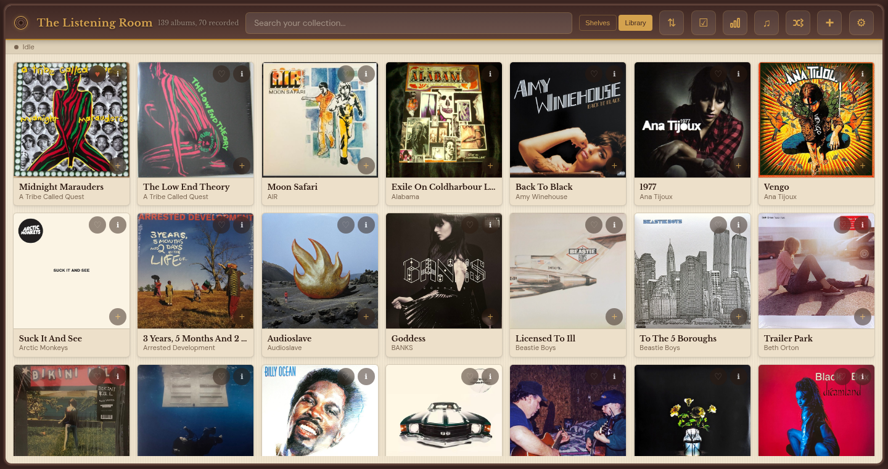

From left to right:

| Element | What it does |
|---|---|
| Logo disc (the vinyl icon) | Opens the app name editor in Settings. |
| **App name** (default: "The Listening Room") | Tap to edit inline. Persisted to `settings.json`. |
| **Album count** (e.g. "139 albums, 70 recorded") | Read only badge showing total albums and how many have at least one recorded side. |
| **Search bar** | Full text search across artist, title, genre, year, label, and notes. Filters results live. Placeholder text changes to "Search shelves..." when the Shelves view is active. Press `F` to focus from anywhere. |
| **Shelves** button | Switches to the [Shelves home](#shelves-home) and also exits the full screen Now Playing hero if it is visible. |
| **Library** button | Switches to the flat [Library grid](#library-grid) and also exits the full screen Now Playing hero if it is visible. |
| **Sort** button (↕) | Opens the [sort and group panel](#sort-and-group-panel). |
| **Select** button (☑) | Toggles [multi select mode](#multi-select-action-bar). Hidden by default; shown in kiosk mode and when you long press a card. |
| **Stats** button (bar chart) | Opens the [Listening Statistics modal](#listening-statistics-modal). |
| **Playlists** button (♫) | Toggles the [playlists panel](#playlists-panel). Shortcut: `P`. |
| **Shuffle** button (crossing arrows) | Runs the library wide shuffle: all recorded albums in random order, starts playback immediately. |
| **Add** button (+) | Opens the [Add record modal](#add-record-modal). |
| **Settings** button (⚙) | Opens the [Settings modal](#settings-modal). Shortcut: `S`. |

Below the header is a status row: a color coded dot and a text label showing **Idle**, **Playing**, **Recording**, or **Streaming**.

## Library grid

Every album in the catalog is rendered as a card:

| Element | Notes |
|---|---|
| Cover artwork | Tap to play the album. If nothing is playing, the [output picker](#output-picker) opens first; if something is playing, this album is added to the queue. |
| **Heart** (top left) | Toggles favorite. Shows filled heart when favorited. |
| **i** (top right) | Opens the [album detail modal](#album-detail-modal). |
| **+** (bottom right) | Adds the album to the queue without starting playback. |
| Album title | Two line truncated. |
| Artist | Single line truncated. |
| Amber border | Indicates the album has at least one recorded side. |
| Dim overlay | Indicates the album is unrecorded. |

Long pressing a card enters [multi select](#multi-select-action-bar) with that card already selected.

## Shelves home

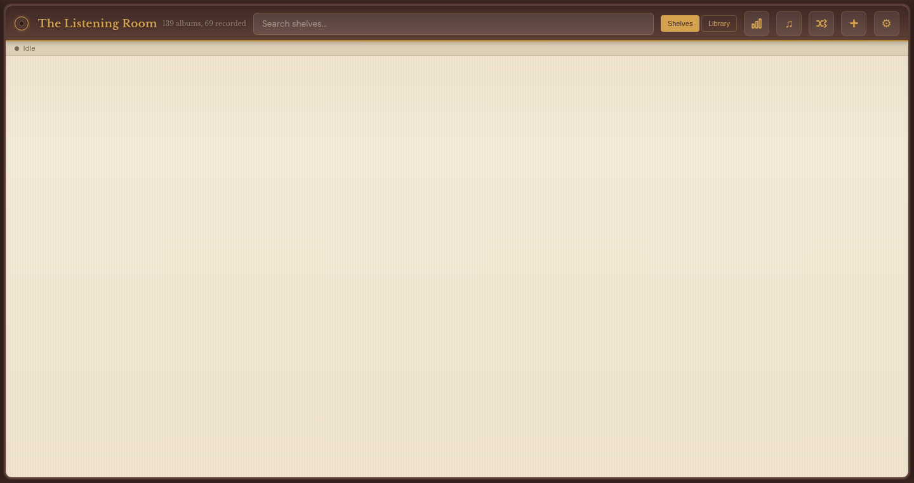

Shelves renders horizontal rows, each with a **Play row** button and a **See All** link. Rows include:

- **Recently Played**: ordered by `last_played_at` descending.
- **Recently Added**: ordered by `created_at` descending.
- **Most Played**: ordered by `play_count` descending.
- **Unplayed**: albums with `play_count = 0`.
- **Favorites**: albums with `favorite = 1`.
- **Top Rated**: albums with rating 4 or 5.
- **Genres**: dynamic rows per detected genre.

**Play row** queues every album in that row in order. **See All** opens a flat grid of that row alone, with the standard library card controls.

## Sort and group panel

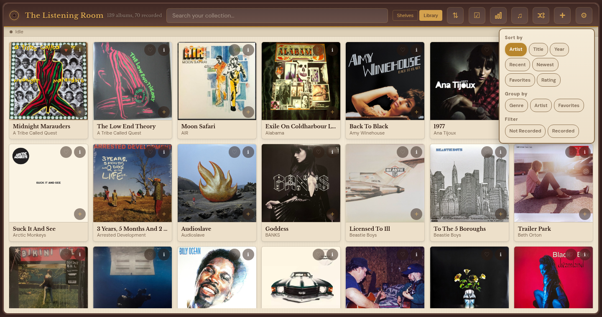

Opens from the header sort button. Three sections:

**Sort by** (radio): Artist, Title, Year, Recent (last played), Newest (created at), Favorites, Rating.

**Group by** (radio): Genre, Artist, Favorites. When set, the grid is broken into labeled sections.

**Filter** (radio): Not Recorded (hide recorded), Recorded (hide unrecorded). Tap the active filter again to clear.

The panel closes by tapping the backdrop. Preferences persist in local storage.

## Multi select action bar

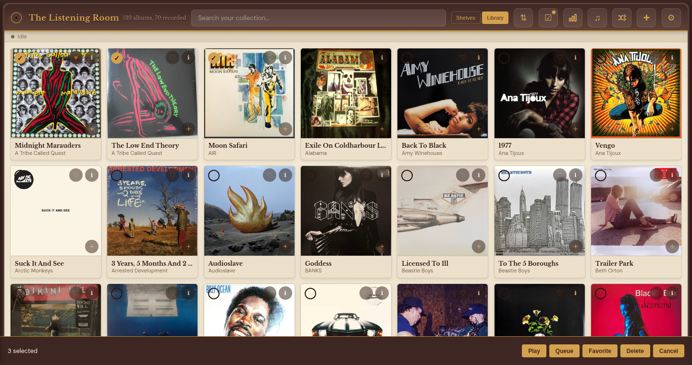

The action bar pins to the bottom while multi select is active.

| Button | Action |
|---|---|
| **Play** | Creates a queue from the selected albums in order and starts playback. |
| **Queue** | Appends the selected albums to the current queue. |
| **Favorite** | Sets `favorite = 1` on every selected album. |
| **Delete** | Deletes every selected album (catalog row, artwork files, and associated FLAC recordings). Shows an undo toast for several seconds. |
| **Cancel** | Exits multi select without acting. |

Selected count is shown on the left. Individual cards have a circular checkbox in the top left.

## Album detail modal

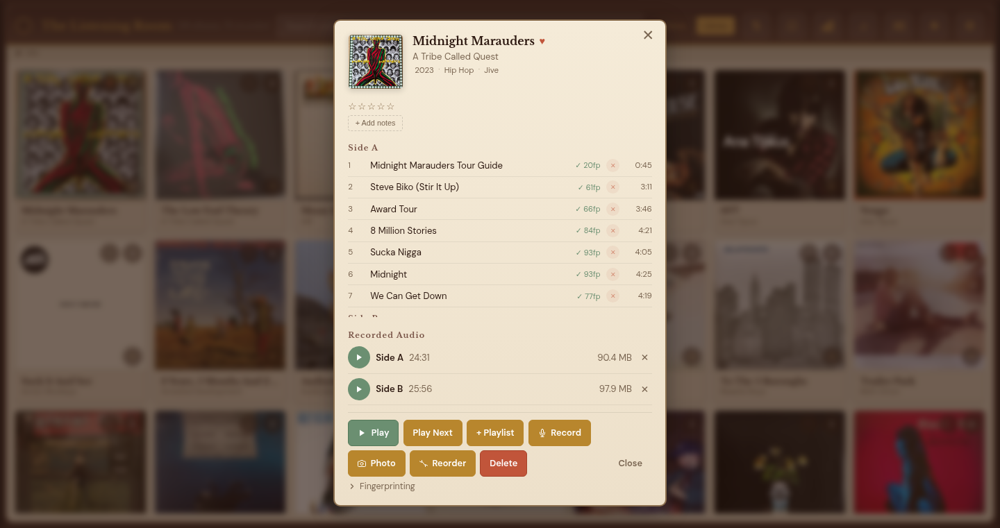

The largest modal in the app. Top to bottom:

### Header area

| Field | Notes |
|---|---|
| Cover art thumbnail | Tap to upload a replacement image or fetch a new one from Discogs. |
| Album title | Tap to edit inline. Saves on blur or Enter. |
| Artist | Tap to edit inline. |
| Year / genre / label chips | Tap to edit individually. Any blank field is hidden. |
| **Favorite** heart | Toggles favorite. |
| Star rating (1 to 5) | Tap a star to set the rating. Tap the active star again to clear. |

### Notes

A free text area for pressing information, condition, provenance, and so on. Shows either the current note (tap to edit) or an **Add Note** button.

### Track list

Each side is a collapsible group. Every track row has:

- Track number.
- Title (tap to edit).
- Duration (tap to edit).
- A small menu for deleting the track or re fingerprinting it individually.
- Tap anywhere on the row (except the edit controls) to start playback from that track.

Tracks that have been fingerprinted and recognized on past plays show a small checkmark.

### Recorded audio panel

Lists the FLAC files associated with this album. Each entry shows:

- Side label (A, B, C, ...).
- File size.
- Duration.
- Actions: **Play side**, **Re fingerprint**, **Edit boundaries**, **Delete recording**.

### Action row (bottom)

| Button | Action |
|---|---|
| **Play** | Starts the album from track 1 side A. Hidden if no audio is recorded yet. |
| **Queue** | Adds the album to the current queue. Hidden if nothing is playing. |
| **Learn** | Starts a fingerprint only pass: captures audio, analyzes it, updates the fingerprint database, and discards the audio. Use this when you already have audio but want to re index it. |
| **Record** | Starts a full recording session. Opens the inline recorder panel (countdown, level meter, stop button, flip side prompt). |
| Kebab menu (⋮) | **Re fingerprint all tracks**, **Reorder sides**, **Reassign track sides**, **Export album**, **Delete album**. |

### Recorder panel (collapsible)

Appears inside the detail modal when a recording is in progress.

| Element | Notes |
|---|---|
| **Countdown** | Skippable pre roll before the recorder starts capturing. |
| **Level meter** | Color coded peak meter: green (good), yellow (hot), red (clipping). |
| **Elapsed timer** | Running duration of the current side. |
| **Stop** | Ends the current side, runs silence detection, and writes the FLAC. |
| **Flip** (when detected) | Appears when the recorder detects an end of side silence. Tap to acknowledge and start side B. |

## Add record modal

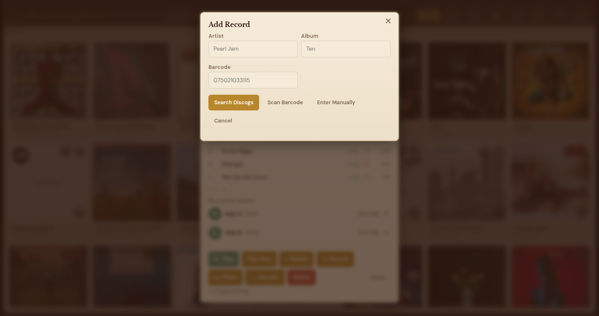

Three step form with tabs for **Search**, **Scan Barcode**, and **Enter Manually**.

### Search step

| Field | Notes |
|---|---|
| **Artist** | Free text. Required. |
| **Album** | Free text. Required. |
| **Search Discogs** | Sends the query and renders results below. |
| **Scan Barcode** | Switches to the barcode scanner tab. |
| **Enter Manually** | Switches to the manual entry tab. |
| **Cancel** | Closes the modal. |

Results are a scrollable list of Discogs releases with cover thumbnail, title, year, country, and format. Tap a result to advance to the confirm step.

### Confirm step

Shows the Discogs track listing, artwork preview, and metadata. Buttons:

- **Save to catalog**: writes the album, downloads artwork, populates track list.
- **Back**: returns to the search step.

### Manual entry step

Lets you type artist, title, year, genre, label, and up to an arbitrary number of tracks with side and track number. Saves a catalog entry with no Discogs ID.

### Barcode scan step

Requests camera access (HTTPS required) and streams the camera preview into a ZXing decoder. When a UPC/EAN is detected, looks up the matching Discogs release and jumps to the confirm step.

## Settings modal

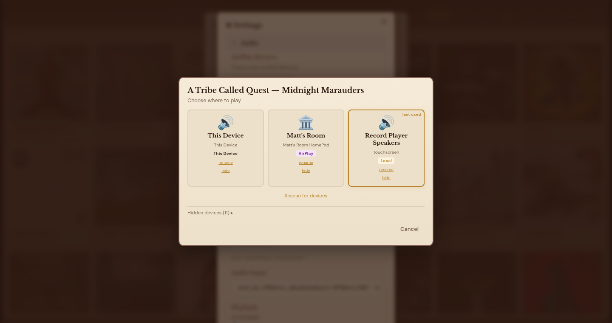

Grouped into collapsible sections.

### Audio

| Control | Description |
|---|---|
| **Scan for Devices** | Re runs the AirPlay discovery scan. Uses `zeroconf` to find RAOP endpoints on the local network. |
| AirPlay device list | Each entry has rename, hide, test tone, and pair (when required) buttons. |
| **Scan for Bluetooth** | Runs `bluetoothctl scan on` for a fixed window and lists discovered devices. |
| Bluetooth device list | Pair, connect, disconnect, remove per device. |
| **Start Streaming** | Begins the live vinyl pipeline: capture, EQ, stream to selected outputs. |
| **Auto stream when needle detected** | Toggle. When on, the Pi watches the input for signal and starts streaming automatically. |
| **Default device** dropdown | Picks the ALSA card used for local output. |
| **Audio Input** dropdown | Picks the capture device used for recording and live vinyl. |
| **Input gain** slider | Software gain applied before recording. |
| **Crossfade** slider (0 to 2s) | Duration of equal power crossfade between album sides. 0 is pure gapless. |

### Recording Detection

| Control | Description |
|---|---|
| **Threshold** slider (0.001 to 0.02, default 0.006) | The input RMS level that auto-record and auto-streaming treat as "audio playing" rather than silence. Lower it if recording will not start on its own with a quieter turntable or preamp; raise it if background hum is triggering it. Saved to `settings.json` as `audio_detect_threshold` and applied live, no restart needed. |

### Library

| Control | Description |
|---|---|
| **Sync from Discogs** | Backfills Discogs metadata for albums missing IDs, refreshes titles, and re downloads artwork. |
| **Backfill Discogs IDs** | Searches Discogs for existing albums that have no ID and attaches one. |
| **Fetch missing artwork** | Batch downloads cover art for albums without it. Shows progress. |
| **Find Duplicate Albums** | Opens the [Duplicates modal](#duplicates-modal). |
| **Build Library Collage** | Generates the `vinyl_collage.jpg` mosaic image of every cover. |
| **Download Catalog Database** | Downloads `catalog.db`. |
| **Download JSON Manifest** | Downloads a JSON list of every album and track for backup. |

### Personalization

| Control | Description |
|---|---|
| **App Name** | Text shown in the top left header. |
| **Accent color** | Theme tint for buttons and highlights. |
| **Density** | Compact / comfortable grid spacing. |

### System

| Control | Description |
|---|---|
| **Current version** | Git commit hash and tag. |
| **Check for Updates** | Hits the remote repo, counts commits behind, offers **Update Now**. |
| **Update Now** | Pulls, installs dependencies, restarts the service, and rolls back on failure. |
| **Backup Settings** / **Restore Settings** | Export or import `settings.json` as a JSON file. |
| **Mobile Access: Download Certificate** | Downloads the mkcert CA for iOS/Android trust installation. |
| **Regenerate Certificates** | Re runs `mkcert` with the Pi's current IP in the SAN. |
| **Storage path** | Where FLAC recordings live. |
| **Free space** | Read only disk usage. |

## Listening Statistics modal

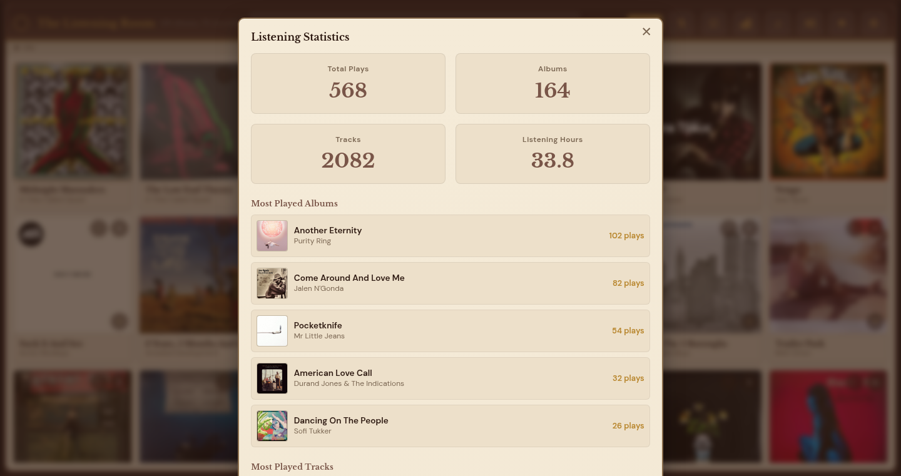

| Section | Contents |
|---|---|
| Top tiles | Total plays, total tracks, listening hours. |
| **Most Played Albums** | Top N albums by play count, with last played timestamps and cover thumbnails. |
| **Most Played Tracks** | Top N individual tracks, with album and artist. |
| **Genre breakdown** | Count per genre tag. |
| **Plays over time** | Simple chart of listening activity by day. |

All data comes from the `play_history` table and the catalog.

## Duplicates modal

Lists albums that appear to be duplicates based on fuzzy matching of artist and title plus Discogs ID comparison. Each group shows the candidates side by side with **Keep this / Delete others** buttons.

## Keyboard shortcuts modal

Opened with `?`. A two column grid of every shortcut (see [Keyboard shortcuts](#keyboard-shortcuts) below).

## EQ modal

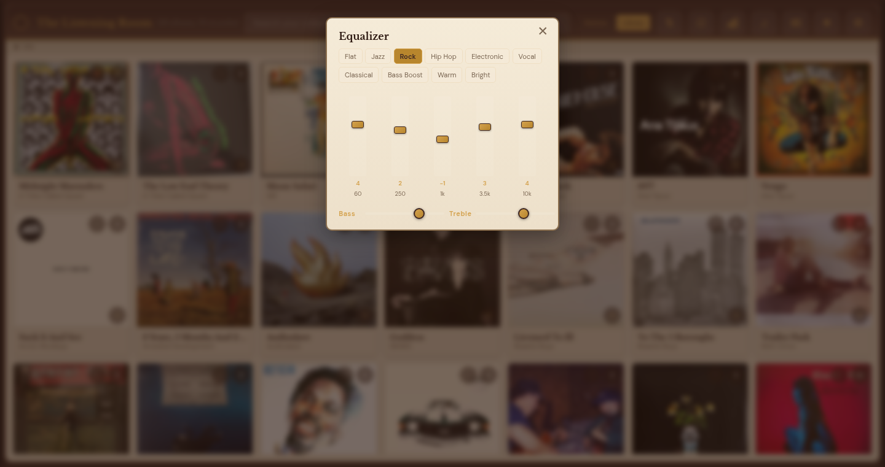

| Control | Description |
|---|---|
| Preset tabs | Flat, Jazz, Rock, Hip Hop, Electronic, Vocal, Classical, Bass Boost, Warm, Bright. Selecting a preset fills the sliders and applies instantly. |
| 5 sliders | 5 band shelving / peaking filter in dB. |
| **Save** | Stores the current curve as a custom named preset. |
| **Delete** | Removes a custom preset. |
| X | Closes the modal (also closes on outside tap). |

Settings apply in real time to all active streams.

## Learn overlay

Full screen overlay used during the original "learn only" pre recording flow. Steps:

- **Setup**: pick the album and the track count for side A.
- **Active**: live waveform and track counter as the side plays.
- **Paused**: appears when the recorder detects silence and asks whether to continue or flip.
- **Done**: summary of learned tracks.

## Output picker

Appears when you start playback with no output selected or when you tap **Switch Output** from the transport.

| Section | Notes |
|---|---|
| **This Device** | The browser you are currently using. Creates a stream ID and streams PCM over HTTP. |
| **AirPlay** | All discovered RAOP devices. Multi select supported. |
| **Bluetooth** | All paired A2DP devices. Only one can be active at a time. |
| **Local** | Devices listed by ALSA on the Pi itself. |
| **Hidden devices (N)** expander | Devices the user has hidden. Unhide from here. |
| **Rescan for devices** | Triggers a fresh zeroconf + bluez scan. |
| **Cancel** | Closes without changing selection. |

Each device card has **rename** and **hide** links. The last used device is remembered and marked.

## Queue panel

Slides out from the right. Shortcut: `Q`.

| Element | Notes |
|---|---|
| **Now playing** row | The currently playing side, with elapsed/remaining timer. |
| **Up next** list | Every queued side in order. Drag the handle to reorder, tap X to remove. |
| **Clear queue** | Empties everything after the current item. |
| **Save as playlist** | Opens a name prompt and stores the queue as a new Albums playlist. |
| X | Closes the panel. |

## Playlists panel

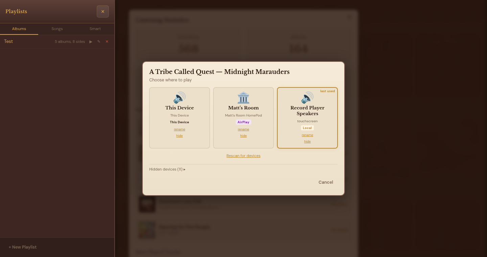

Slides out from the left. Three tabs:

| Tab | Contents |
|---|---|
| **Albums** | Ordered lists of full albums. Tap to play, long press to edit. |
| **Songs** | Ordered lists of individual tracks. |
| **Smart** | Rule based dynamic playlists. See [Smart playlist builder](#smart-playlist-builder). |

At the bottom: **+ New Playlist** creates a new blank playlist. Each playlist row has play, queue, edit, and delete actions.

## Smart playlist builder

Opened from the Smart tab. Lets you build a rule based playlist with clauses like "rating >= 4", "genre is Jazz", "play_count < 3", "not recorded", "added in the last 30 days". Rules AND together by default. Save names the playlist. Smart playlists re evaluate every time they are opened.

## Now Playing hero and bar

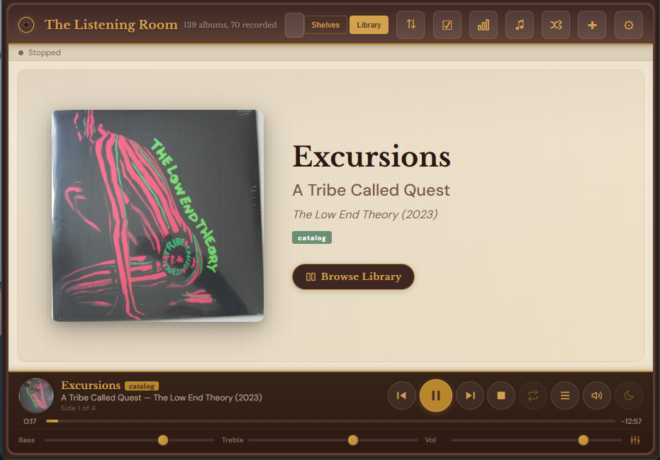

The hero fills the main content area when something is playing and the bar mode is not active.

| Element | Notes |
|---|---|
| Large artwork | Tap to open the [album detail modal](#album-detail-modal) for the currently playing album. |
| Track title | Current track. |
| Artist and album | Metadata line. |
| **Browse Library** button | Collapses the hero into a bar at the bottom and shows the library grid. |

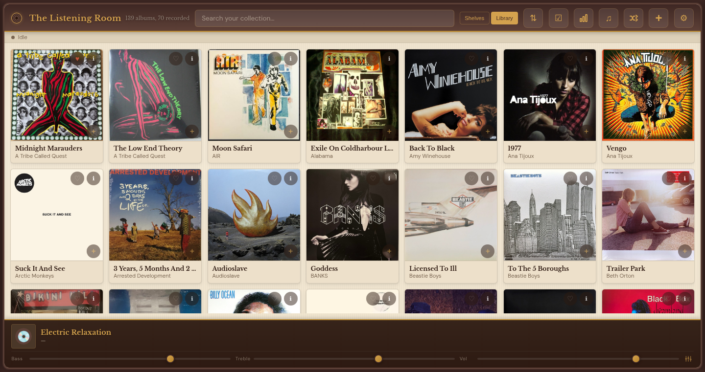

In bar mode, the bar pinned to the bottom of the screen shows:

| Element | Notes |
|---|---|
| Expand button (arrows) | Re opens the full screen hero. Only visible while the hero is collapsed. |
| Mini cover + title | Click to expand the hero. |
| **Prev** | Previous track. |
| **Play / Pause** | Toggles playback. Shortcut: Space. |
| **Next** | Next track. Shortcut: N. |
| **Progress bar** | Tap or drag to seek. Shows elapsed and remaining time. |
| Side indicator | "Side 2 of 4" style label. |
| Volume slider | Per session volume, respected by all outputs. |
| **Switch Output** | Re opens the output picker. |
| **Queue** | Toggles the queue panel. Shortcut: Q. |
| **EQ** | Opens the [EQ modal](#eq-modal). |
| **Stop** | Ends playback and hides the bar/hero entirely. |

## Screensaver

After the configured idle timeout (Settings > Personalization > Screensaver), the full screen now playing display fades in:

- Spinning vinyl disc with embedded album cover art.
- Track title, artist, album.
- Progress bar with elapsed/remaining.
- Side indicator ("Side 1 of 2").
- Animated EQ visualization reacting to the audio.
- Subtle vinyl crackle effect.

Any touch, mouse move, or key press wakes the screen with a fade out.

## Keyboard shortcuts

| Key | Action |
|---|---|
| `Space` | Play / pause |
| `N` | Next track |
| `Up` / `Down` | Volume up / down |
| `Q` | Toggle queue panel |
| `P` | Toggle playlists panel |
| `S` | Open settings |
| `F` | Focus search bar |
| `Escape` | Close the current modal or panel |
| `?` | Show keyboard shortcuts modal |

Shortcuts are captured at the `window` level but ignored when an input, textarea, or contenteditable element has focus.

---

## HTTP API

Vinyl Streamer exposes a REST API over HTTP (8080) and HTTPS (8443). These are the routes the web UI calls, grouped by domain.

### System and status

| Method | Path | Purpose |
|---|---|---|
| `GET` | `/` | Serves `templates/index.html`. |
| `GET` | `/manifest.json` | PWA manifest. |
| `GET` | `/service-worker.js` | PWA service worker. |
| `GET` | `/api/status` | Player, recording, and streaming state. |
| `GET` | `/api/scan` | Runs a discovery scan for AirPlay, Bluetooth, and local output devices. |
| `POST` | `/api/start` | Starts the live vinyl streaming pipeline. |
| `POST` | `/api/stop` | Stops the live vinyl streaming pipeline. |

### Devices and outputs

| Method | Path | Purpose |
|---|---|---|
| `GET` | `/api/devices` | List all known AirPlay, Bluetooth, and local devices. |
| `POST` | `/api/devices/{id}/pair/start` | Start pairing for an AirPlay device. |
| `POST` | `/api/devices/{id}/pair/pin` | Submit a pairing PIN. |
| `POST` | `/api/devices/{id}/pair/cancel` | Cancel an in flight pair. |
| `POST` | `/api/devices/{id}/hide` | Hide a device from the output picker. |
| `POST` | `/api/devices/{id}/rename` | Rename a device. |
| `GET` | `/api/audio-devices` | Local ALSA devices. |
| `GET` | `/api/bluetooth/scan` | Bluetooth discovery. |
| `POST` | `/api/bluetooth/{id}/pair` | Pair a Bluetooth device. |
| `POST` | `/api/bluetooth/{id}/connect` | Connect to a paired device. |
| `POST` | `/api/bluetooth/{id}/disconnect` | Disconnect. |
| `POST` | `/api/bluetooth/{id}/remove` | Unpair. |
| `GET` | `/api/bluetooth/codec` | Currently negotiated A2DP codec. |
| `POST` | `/api/stream/create` | Create an in browser stream session. |
| `GET` | `/api/stream/{id}` | HTTP PCM stream endpoint for "This Device" output. |

### Catalog

| Method | Path | Purpose |
|---|---|---|
| `GET` | `/api/catalog` | Full catalog (albums). |
| `GET` | `/api/catalog/shelves` | Shelves home data (Recently Played, Most Played, etc). |
| `GET` | `/api/catalog/shelves/optimized` | Lightweight shelves payload for fast first render. |
| `GET` | `/api/catalog/history` | Play history. |
| `GET` | `/api/catalog/stats` | Listening statistics aggregations. |
| `GET` | `/api/catalog/tracks/search` | Full text track search. |
| `GET` | `/api/catalog/{id}/tracks` | Tracks for a single album. |
| `POST` | `/api/catalog/{id}/tracks` | Create a track. |
| `PUT` | `/api/catalog/track/{id}` | Update track metadata. |
| `PUT` | `/api/catalog/track/{id}/boundaries` | Update track start/end times. |
| `DELETE` | `/api/catalog/track/{id}` | Delete a track. |
| `POST` | `/api/catalog/{id}/artwork` | Upload replacement artwork. |
| `POST` | `/api/catalog/manual` | Create an album manually. |
| `GET` | `/api/catalog/search/discogs` | Search Discogs for albums. |
| `GET` | `/api/catalog/release/discogs/{id}` | Fetch a single Discogs release. |
| `POST` | `/api/catalog/release` | Create an album from a Discogs release. |
| `POST` | `/api/catalog/sync/discogs` | Sync metadata from Discogs. |
| `GET` | `/api/catalog/sync/discogs/status` | Sync progress. |
| `POST` | `/api/catalog/sync/discogs/backfill-ids` | Backfill missing Discogs IDs. |
| `POST` | `/api/catalog/artwork/fetch-missing` | Batch fetch missing artwork. |
| `GET` | `/api/catalog/artwork/fetch-missing/status` | Fetch progress. |
| `POST` | `/api/catalog/collage` | Generate the library collage image. |
| `POST` | `/api/catalog/{id}/learn` | Start a learn session (fingerprint only). |
| `POST` | `/api/catalog/{id}/re-fingerprint` | Re fingerprint all tracks. |
| `POST` | `/api/catalog/track/{id}/re-fingerprint` | Re fingerprint a single track. |
| `DELETE` | `/api/catalog/{id}/fingerprints` | Delete all fingerprints for an album. |
| `DELETE` | `/api/catalog/track/{id}/fingerprints` | Delete fingerprints for a track. |
| `POST` | `/api/catalog/{id}/reorder` | Reorder tracks. |
| `POST` | `/api/catalog/{id}/reassign-sides` | Reassign tracks to different sides. |
| `POST` | `/api/catalog/{id}/favorite` | Toggle favorite. |
| `DELETE` | `/api/catalog/{id}` | Delete an album. |

### Player and queue

| Method | Path | Purpose |
|---|---|---|
| `GET` | `/api/player/status` | Current track, position, queue, volume. |
| `POST` | `/api/player/play` | Start playback of a queue. |
| `POST` | `/api/player/pause` | Pause. |
| `POST` | `/api/player/resume` | Resume. |
| `POST` | `/api/player/stop` | Stop. |
| `POST` | `/api/player/next` | Skip to next track. |
| `POST` | `/api/player/prev` | Skip to previous track. |
| `POST` | `/api/player/seek` | Seek to a position. |
| `POST` | `/api/volume` | Set volume. |

### Playlists

| Method | Path | Purpose |
|---|---|---|
| `GET` | `/api/playlists` | List playlists. |
| `POST` | `/api/playlists` | Create a playlist. |
| `POST` | `/api/playlists/{id}/add` | Add an album. |
| `POST` | `/api/playlists/{id}/reorder` | Reorder items. |
| `POST` | `/api/playlists/{id}/remove` | Remove an item. |
| `DELETE` | `/api/playlists/{id}` | Delete. |
| `PUT` | `/api/playlists/{id}/rename` | Rename. |
| `GET` | `/api/smart-playlists` | List smart playlists. |
| `POST` | `/api/smart-playlists` | Create a smart playlist. |
| `PUT` | `/api/smart-playlists/{id}` | Update rules. |
| `DELETE` | `/api/smart-playlists/{id}` | Delete. |
| `GET` | `/api/smart-playlists/{id}/albums` | Resolve the rule set into concrete albums. |
| `POST` | `/api/smart-playlists/{id}/play` | Play a smart playlist. |

### EQ

| Method | Path | Purpose |
|---|---|---|
| `POST` | `/api/eq` | Set legacy bass/treble. |
| `GET` | `/api/eq/bands` | Current 5 band values. |
| `POST` | `/api/eq/bands` | Update 5 band values. |
| `GET` | `/api/eq/presets` | List presets. |
| `POST` | `/api/eq/preset/{name}` | Apply a preset. |

### Settings, backup, updates

| Method | Path | Purpose |
|---|---|---|
| `POST` | `/api/settings` | Update arbitrary settings keys. |
| `POST` | `/api/settings/backup` | Create a settings backup. |
| `GET` | `/api/settings/backup/download` | Download the backup file. |
| `POST` | `/api/settings/restore` | Restore from an uploaded backup. |
| `POST` | `/api/settings/storage` | Change the storage path. |
| `GET` | `/api/browse-dirs` | Directory picker for the storage path. |
| `GET` | `/api/screenshot` | Server side screenshot endpoint (used for `api/catalog/collage`). |
| `GET` | `/artwork/{filename}` | Serves album artwork files. |

The routes above are split across `main.py` and the `routes_*.py` modules. For implementation details, see the inline comments in each. The mapping from route group to module is listed under [Top level Python modules](#top-level-python-modules).

---

## CLI and services

### systemd services installed by `install.sh`

| Service | Purpose |
|---|---|
| `vinyl-airplay.service` | Runs `main.py` under the `listen` user, restarts on failure. |
| `vinyl-airplay-kiosk.service` | Launches Chromium in kiosk mode on the local touchscreen. |
| `vinyl-airplay-wifi.service` | Brings up the captive portal for first time WiFi configuration when no network is available. |

All services are managed with standard systemd commands:

```
sudo systemctl restart vinyl-airplay
sudo journalctl -u vinyl-airplay -f
```

### Scripts

| Script | Purpose |
|---|---|
| `install.sh` | One line installer. Installs dependencies, creates the `listen` user, clones the repo, sets up the virtualenv and services, runs `mkcert`. |
| `kiosk.sh` | Starts Chromium in kiosk mode pointed at `http://localhost:8080`. Called from the kiosk service. |
| `make_collage.py` | Builds the `vinyl_collage.jpg` mosaic from every cover in the catalog. Called from the API but can be run manually. |
| `wifi_setup.py` | Captive portal WiFi setup. Runs a small web server on a local AP so you can join the Pi to a network from a phone. |

### Top level Python modules

`main.py` was originally a single large file. It has since been split into focused modules. `main.py` is now a thin entry point: it builds the FastAPI app, runs the lifespan, mounts the `routes_*.py` routers, starts the audio / playback / recording engines, and keeps the routes that are tightly coupled to live runtime state (devices, streaming control, recording orchestration, player control, and catalog / playlist CRUD).

**Core**

| File | Purpose |
|---|---|
| `main.py` | FastAPI app and lifespan, HTTP/HTTPS servers, router and engine wiring, and the device / streaming / recording / player / catalog routes coupled to runtime state. |
| `app_state.py` | Shared `AppState`, the global `state` object, the background-task spawner, and the WebSocket `broadcast` helper. |
| `config.py` | Settings load/save, filesystem paths, and the Jinja2 template environment. |

**Catalog, recording, playback**

| File | Purpose |
|---|---|
| `catalog.py` | SQLite catalog schema, Discogs client, Chromaprint fingerprint index, album and track CRUD. |
| `recorder.py` | Recording buffer, silence detection, track splitting, FLAC writing. |
| `player.py` | FLAC playback engine with side transitions, gapless buffering, and crossfade. |
| `exporter.py` | Catalog database and JSON manifest export helpers. |

**Audio pipeline**

| File | Purpose |
|---|---|
| `streaming.py` | Live vinyl stream coordinator (auto-stream watcher, capture setup) and listen mode. |
| `audio_streams.py` | The sounddevice capture callback plus the audio sink classes (AirPlay, local, browser). |
| `audio_eq.py` | Real-time 5 band EQ (shelving / peaking filters). |
| `audio_mp3.py` | MP3 encoder for the browser / HTTP `live.mp3` stream. |
| `transports_bluetooth.py` | Bluetooth (BlueALSA / A2DP) output transport. |

**Engines and helpers**

| File | Purpose |
|---|---|
| `recording_engine.py` | Album-side auto-finalize, encode and save, and the stream stall watchdog. |
| `player_engine.py` | Playback and queue orchestration (run playback, build side entries, stop). |
| `learn_engine.py` | Fingerprint "learn" sessions. |
| `recognition.py` | Live recognition match callbacks and artwork helpers. |
| `device_helpers.py` | Local and Bluetooth device discovery and capture channel selection. |

**API routers** (each an `APIRouter` mounted by `main.py`)

| File | Purpose |
|---|---|
| `routes_catalog.py` | Catalog browse and shelves, track CRUD and boundaries, Discogs search/sync, artwork, collage. |
| `routes_catalog_stats.py` | Library insights: duplicates, heatmap, genre / artist / decade breakdowns, on-this-day, weekly trend. |
| `routes_eq.py` | Volume, EQ bands, and presets. |
| `routes_bluetooth.py` | Bluetooth scan, pair, connect, disconnect, remove, codec. |
| `routes_settings.py` | Settings backup / restore, storage path, folder picker, screenshot. |
| `routes_export.py` | Recorded-audio access and the FLAC export pipeline (per album, bulk, browse, download). |
| `routes_system.py` | TLS certificates, self-update, WiFi portal. |

---

## File layout

```
vinyl-airplay/
├── main.py                  # FastAPI app and lifespan; wires routers + engines
├── app_state.py             # Shared runtime state, background tasks, broadcast
├── config.py                # Settings load/save, paths, template environment
│
├── catalog.py               # Catalog, Discogs, fingerprinting
├── recorder.py              # Recording, silence detection, track splitting
├── player.py                # FLAC playback engine
├── exporter.py              # Catalog database / JSON manifest export
│
├── streaming.py             # Live vinyl stream coordinator + listen mode
├── audio_streams.py         # Capture callback and audio sink classes
├── audio_eq.py              # Real-time EQ (shelving / peaking filters)
├── audio_mp3.py             # MP3 encoder for the browser / HTTP stream
├── transports_bluetooth.py  # Bluetooth (BlueALSA / A2DP) output
│
├── recording_engine.py      # Album-side auto-finalize, encode/save, watchdog
├── player_engine.py         # Playback and queue orchestration
├── learn_engine.py          # Fingerprint "learn" sessions
├── recognition.py           # Live recognition callbacks + artwork helpers
├── device_helpers.py        # Local / Bluetooth device discovery
├── routes_*.py              # API routers by domain
│
├── make_collage.py          # Collage builder
├── wifi_setup.py            # Captive portal WiFi setup
├── install.sh               # One line installer
├── kiosk.sh                 # Chromium kiosk launcher
├── requirements.txt         # Python dependencies
├── templates/
│   └── index.html           # Web UI (single page app)
├── docs/                    # Documentation
│   ├── getting-started.md
│   ├── user-guide.md
│   ├── reference.md
│   └── images/              # UI screenshots for the docs
├── screenshots/             # Hardware photos and legacy UI screenshots
├── README.md                # Top level project overview
├── settings.json            # User configuration (auto created)
└── data/                    # SQLite catalog, artwork, FLAC recordings (auto created)
```

The `data/` directory and `settings.json` are created on first run and are excluded from git. Everything under `data/` is safe to back up and restore.

---

## Where next

- **[Getting Started](getting-started.md)**: 5 minute intro for new users.
- **[User Guide](user-guide.md)**: feature by feature tour with workflows.
- **[README](../README.md)**: hardware, install, audio paths, architecture.
